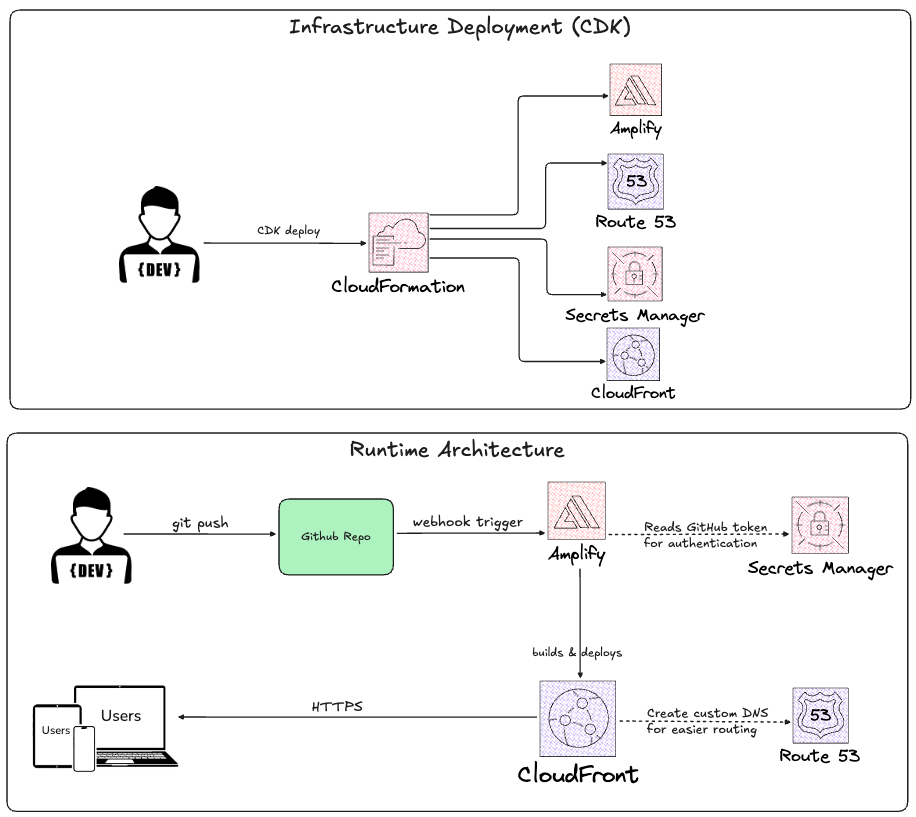

# Portfolio Site with AWS Amplify CI/CD

A modern portfolio website built with Next.js and deployed on AWS Amplify with automated CI/CD pipeline.

🌐 **Live Site:** [main.dw4k8zj5zj0c5.amplifyapp.com](https://main.dw4k8zj5zj0c5.amplifyapp.com)

## Architecture



### Tech Stack
- **Frontend:** Next.js, React, TypeScript, Tailwind CSS
- **Hosting:** AWS Amplify with CloudFront CDN
- **CI/CD:** Automated deployments via GitHub webhooks
- **Infrastructure:** AWS CDK (TypeScript)
- **DNS:** Route 53
- **Secrets:** AWS Secrets Manager (GitHub token)

### How It Works

**Infrastructure Deployment (one-time):**
1. Developer runs `cdk deploy` from local machine
2. CloudFormation creates all AWS resources (Amplify, Route 53, Secrets Manager, CloudFront)

**Runtime Flow:**
1. Developer pushes code to GitHub
2. GitHub webhook triggers Amplify build
3. Amplify pulls code (authenticates via Secrets Manager)
4. Amplify builds and deploys to CloudFront
5. Users access site through CloudFront CDN

## Features

- Responsive design
- Automated deployments on every push to main branch
- Infrastructure as Code using AWS CDK
- Secure credential management with AWS Secrets Manager
- Global content delivery via CloudFront

## Project Structure
```
portfolio-project/
├── portfolio/                    # Next.js frontend
│   ├── src/                      # Source code
│   ├── public/                   # Static assets
│   └── architecture/             # Architecture diagrams
└── portfolio-infrastructure/     # CDK infrastructure code
```

## Deployment

### Prerequisites
- AWS CLI configured
- Node.js 18+
- AWS CDK installed (`npm install -g aws-cdk`)

### Deploy Infrastructure
```bash
cd portfolio-infrastructure
npm install
cdk deploy
```

### Local Development
```bash
cd portfolio
npm install
npm run dev
```

## Author

**Alan Le**
- GitHub: [github.com/elnala24](https://github.com/elnala24)
- LinkedIn: [linkedin.com/in/alantommyle](https://linkedin.com/in/alantommyle)